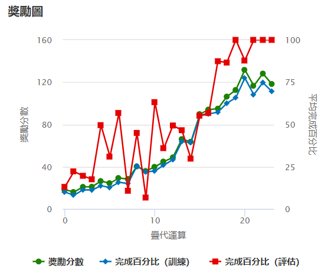
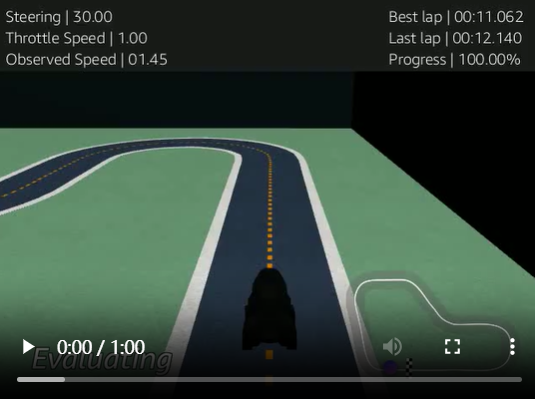

## 🧪 初始穩定模型（v1.0）

這是最早訓練成功並穩定完賽的模型，使用**簡單且保守的獎勵函數**與**基礎動作空間**。雖然圈速未達極致，但非常適合作為 baseline 或 fine-tune 基底。

---

### ✅ 訓練結果圖（穩定成長）



- 🟢 **獎勵分數（Reward）**：  
  隨著訓練疊代增加，模型逐步學會穩定行駛，總獎勵明顯提升，顯示策略正在收斂。

- 🔵 **完成百分比（訓練）**：  
  在前期略有波動，約在第 10 疊代後穩定上升，表示訓練過程中車輛愈來愈能跑完整圈。

- 🔴 **完成百分比（評估）**：  
  起初不穩，但在第 15 疊代後迅速提升，最終達到 100%，代表模型已能在實測中穩定完賽。

---

### 🔍 評估影片截圖



- **Best lap**：`11.062 秒`
- **Progress**：`100.00%`

---

### ⚙️ 模型設定摘要

- 賽道：`re:Invent 2018（逆時針）`
- 訓練時間：120 分鐘
- 演算法：PPO
- 動作空間：10 組（基礎彎道 + 部分直線）
- 學習率：`0.0003`
- 熵值 : `0.01`

### 🕹 動作空間設定（共 10 組）

| 序號 | 轉向角 (°) | 速度 (m/s) |
|------|------------|------------|
| 0    | -30        | 1.0        |
| 1    | -30        | 1.5        |
| 2    | -15        | 1.5        |
| 3    | -15        | 2.0        |
| 4    | 0          | 3.0        |
| 5    | 0          | 4.0        |
| 6    | 15         | 1.5        |
| 7    | 15         | 2.0        |
| 8    | 30         | 1.0        |
| 9    | 30         | 1.5        |


---

### 🧠 使用的獎勵函數（v1.0）

```python
def reward_function(params):
    all_wheels_on_track = params['all_wheels_on_track']
    distance_from_center = params['distance_from_center']
    track_width = params['track_width']

    reward = 1e-3

    if all_wheels_on_track and (0.5 * track_width - distance_from_center) >= 0.05:
        reward = 1.0

    return float(reward)
