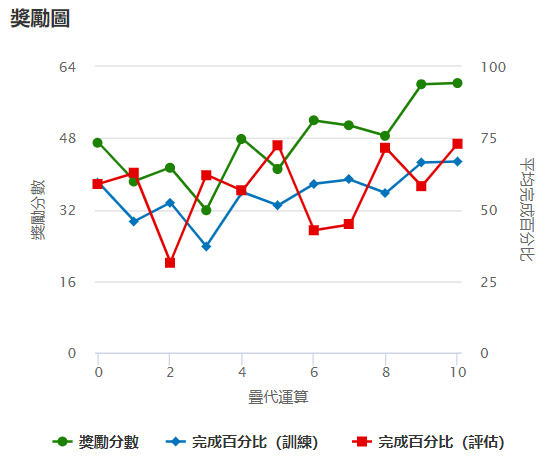

## 🧪 第三次 Fine-tune 模型（v1.2）

此版本在 v1.1 的基礎上再度調整獎勵策略與動作空間，強化過彎處理與速度控制，目標是提升**圈速穩定性**與**完成率**的雙重平衡，並且將訓練時間從原本的30分鐘增加到60分鐘。

---

### ✅ 訓練結果圖（穩中有升）



- 獎勵曲線起伏較前穩定，但上升幅度略趨平緩，推測模型已進入穩定學習階段。
- 訓練與評估完成率接近同步成長，顯示策略泛化效果優於 v1.1。

---

### 🔍 評估影片截圖


- **圈速再創新低：從 9.011 秒 → 提升至 `8.817 秒`**。
- **Progress：100% 完賽成功，代表學習策略穩定性大幅提升。**

---

### ⚙️ 模型設定摘要

- 🛣 賽道：`re:Invent 2018（逆時針）`
- ⏱ 訓練時長：**由 30 分鐘 → 延長至 60 分鐘**
- 🤖 演算法：PPO
- 🎥 感測器：相機（與前相同）

#### 🧮 超參數設定

| 超參數         | v1.1       | v1.2       | 變化說明                                       |
|----------------|------------|------------|------------------------------------------------|
| batch size     | 64         | 64         | 無變動                                        |
| epochs         | 10         | 10         | 無變動                                        |
| learning rate  | 0.00003    | **0.00005**| 🔼 輕微提升學習效率，仍保持穩定                 |
| entropy        | 0.01       | **0.001**  | 🔽 降低訓練時隨機探索率，強化策略穩定性               |
| discount       | 0.99       | 0.99       | 無變動                                        |
| loss type      | Huber      | Huber      | 無變動                                        |
| 更新頻率        | 20         | 20         | 無變動                                        |

📌 **說明：**

- `learning rate` 微幅上調，讓訓練收斂更有效率。
- `entropy` 顯著降低，有助於模型從「探索」轉向「利用」，特別適合 fine-tune 穩定模型。

---

### 🕹 動作空間設定（共 10 組）

- 變化說明：相比 v1.1，本次將轉向角 ±15° 的動作，速度各增加了 0.5 m/s，進一步測試速度的極限。

| 序號 | 轉向角 (°) | 速度 (m/s) |
|------|------------|------------|
| 0    | -30        | 1.5        |
| 1    | -30        | 2.0        |
| 2    | -15        | 2.0        |
| 3    | -15        | 3.0        |
| 4    | 0          | 3.0        |
| 5    | 0          | 4.0        |
| 6    | 15         | 2.0        |
| 7    | 15         | 3.0        |
| 8    | 30         | 1.5        |
| 9    | 30         | 2.0        |

---

### 🧠 使用的獎勵函數（v1.2）

- 新增「**轉向角 + 速度匹配邏輯**」，明確定義彎道需減速、直線可提速。
- 對於「不合適的速度使用」給予懲罰，改善過彎失控問題。

```python
def reward_function(params):
    all_wheels_on_track = params['all_wheels_on_track']
    distance_from_center = params['distance_from_center']
    track_width = params['track_width']
    speed = params['speed']
    steering = abs(params['steering_angle'])

    reward = 1e-3

    # 中心獎勵
    marker_1 = 0.1 * track_width
    marker_2 = 0.25 * track_width
    marker_3 = 0.5 * track_width

    if distance_from_center <= marker_1:
        reward = 1.0
    elif distance_from_center <= marker_2:
        reward = 0.5
    elif distance_from_center <= marker_3:
        reward = 0.1
    else:
        reward = 1e-3

    # 出界懲罰
    if not all_wheels_on_track:
        return 1e-3

    # 彎道：小角度鼓勵高速度，大角度鼓勵減速
    if steering < 10 and speed >= 3.0:
        reward *= 1.5
    elif steering > 20 and speed <= 2.0:
        reward *= 1.2
    else:
        reward *= 0.8  # 不合適的速度懲罰

    return float(reward)

