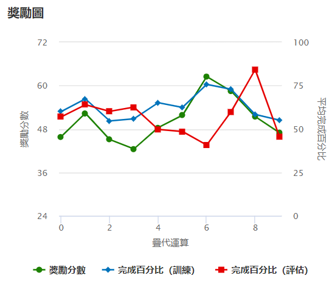
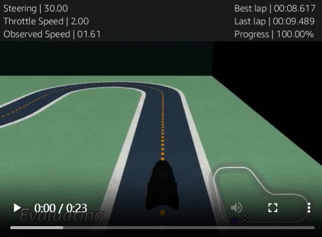

## 🔁 第四版模型（v1.3）

本次為第三次 fine-tune，根據 v1.2 基礎進行進一步優化，特別強化彎道速度表現與方向控制靈敏度。

> ⚠️ **相比 v1.2 的調整：**
> - **動作空間增強**：將 ±15° 轉向角速度為2.0 m/s 提升至 2.5 m/s，以強化彎道衝刺效率。
> - **reward 函數更新**：額外新增轉向獎勵設計，針對轉向角< 5 / < 15 / > 15 對獎勵進行 1.4、1.0、0.8 調整。

---

### ✅ 訓練結果圖（穩定提升）



- 🟢 **獎勵分數**：波動下降，穩定上升，reward 高於前一版本。
- 🔵 **訓練完成率**：中後段穩定維持在 50–60%，代表策略逐漸成熟。
- 🔴 **評估完成率**：多數疊代達到 60~90%，整體穩定度提升。

---

### 🎥 評估影片截圖



- **Best lap**：`08.617 秒`（目前最佳）
- **Progress**：`100%`

---

### ⚙️ 模型設定摘要（v1.3）

- 🛣 賽道：`re:Invent 2018（逆時針）`
- 🕓 訓練時長：60 分鐘
- 🤖 強化演算法：PPO
- 🎥 感測器：相機

#### 🎮 動作空間（共 10 組）

| 序號 | 轉向角 (°) | 速度 (m/s) |
|------|------------|------------|
| 0    | -30        | 1.5        |
| 1    | -30        | 2.0        |
| 2    | -15        | 2.5        |
| 3    | -15        | 3.0        |
| 4    | 0          | 3.0        |
| 5    | 0          | 4.0        |
| 6    | 15         | 2.5        |
| 7    | 15         | 3.0        |
| 8    | 30         | 1.5        |
| 9    | 30         | 2.0        |

---

#### 🔧 超參數設定（v1.3）

| 參數名稱                          | 數值      |
|----------------------------------|-----------|
| Batch Size                       | 64        |
| Number of Epochs                | 10        |
| Learning Rate                   | 0.00005   |
| Entropy                         | 0.001     |
| Discount Factor                 | 0.99      |
| Loss Type                       | Huber     |
| Policy Update Frequency (exp)  | 20        |

---

### 🧠 獎勵函數程式碼（v1.3）

```python
def reward_function(params):
    import math

    all_wheels_on_track = params['all_wheels_on_track']
    distance_from_center = params['distance_from_center']
    track_width = params['track_width']
    speed = params['speed']
    steering = abs(params['steering_angle'])

    reward = 1e-3

    # 中心獎勵
    if distance_from_center <= 0.1 * track_width:
        reward = 1.0
    elif distance_from_center <= 0.25 * track_width:
        reward = 0.5
    elif distance_from_center <= 0.5 * track_width:
        reward = 0.1
    else:
        return 1e-3

    # 轉向角控制：鼓勵穩定方向，小角度高獎勵
    if steering < 5:
        reward *= 1.4
    elif steering < 15:
        reward *= 1.0
    else:
        reward *= 0.8  # 過度轉向懲罰

    # 速度控制：在合適角度下鼓勵加速
    if speed >= 3.0 and steering < 10:
        reward *= 1.5
    elif speed <= 2.0 and steering > 15:
        reward *= 1.2
    else:
        reward *= 0.9

    return float(reward)

